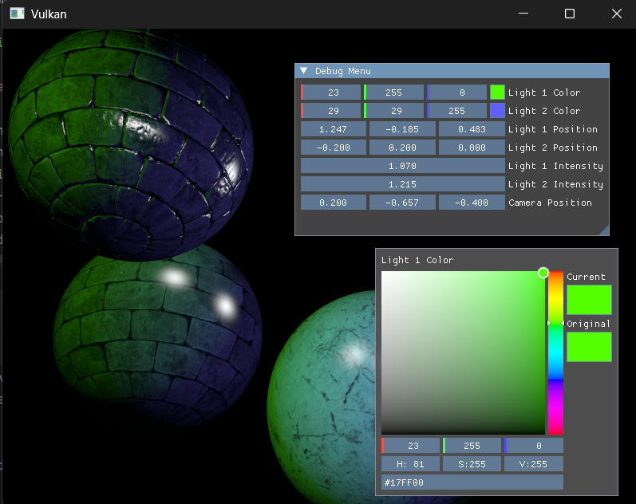

# Vulkan Renderer

A real-time 3D renderer built from scratch in modern **C++20** on the **Vulkan 1.4** API. A small forward renderer with physically-motivated lighting, normal mapping, compressed textures, and a live debug UI — currently being extended toward a deferred (G-buffer) pipeline.

> A graphics-programming passion project. The focus is on understanding the API end to end — explicit synchronization, memory management, descriptor layouts, and the shading math — rather than leaning on an engine.

## Screenshot




## Features

**Rendering & lighting**
- Blinn-Phong shading with point lights, distance attenuation, and configurable intensity/colour
- Multi-light support
- Tangent-space **normal mapping** — optional per object, with a fallback to interpolated vertex normals
- Gamma-correct output (linear lighting → sRGB)
- MSAA and depth buffering

**Assets & textures**
- **KTX2** compressed textures with mipmaps, uploaded via the KTX-Software library
- Model loading through **tinyobjloader** (`.obj`) and **tinygltf** (`.gltf`/`.glb`)
- Per-vertex tangent generation with **MikkTSpace** for correct normal-map lighting

**Engine architecture**
- Written against the **Vulkan-Hpp RAII** bindings for exception-safe, leak-resistant resource handling
- **vk-bootstrap** for instance/device/swapchain setup
- **Vulkan Memory Allocator (VMA)** for all buffer and image allocations
- Two-tier descriptor model — a per-frame *global* set (camera + lighting) and a per-object set (transforms + material textures)
- A reusable descriptor-set allocator that grows its pool on demand, plus a small layout-builder helper
- Frames-in-flight double buffering with explicit semaphore/fence synchronization
- **SDL3** windowing and keyboard camera controls
- **Dear ImGui** overlay for live tweaking of lighting and debug parameters

**Shaders**
- Authored in **Slang**, compiled to SPIR-V as part of the CMake build

## Tech stack

| Area | Library |
|------|---------|
| Graphics API | Vulkan 1.4 (Vulkan-Hpp RAII) |
| Device/swapchain setup | vk-bootstrap |
| GPU memory | VulkanMemoryAllocator (VMA) |
| Windowing & input | SDL3 |
| UI | Dear ImGui |
| Shaders | Slang → SPIR-V |
| Textures | KTX-Software (KTX2), stb |
| Model loading | tinyobjloader, tinygltf |
| Tangents | MikkTSpace |
| Math | GLM |

## Building

**Requirements**
- A C++20 compiler
- CMake ≥ 4.0
- The [Vulkan SDK](https://vulkan.lunarg.com/) (includes the `slangc` shader compiler)

**Clone with submodules** — all third-party dependencies are pulled in as git submodules:

```bash
git clone --recurse-submodules <repo-url>
cd vulkan-doc-tutorial
```

If you already cloned without `--recurse-submodules`:

```bash
git submodule update --init --recursive
```

**Configure and build:**

```bash
cmake -B build
cmake --build build
```

Slang shaders are compiled to SPIR-V automatically as a build step.

> **Note:** This is an active learning project, so a few paths are currently hardcoded to the author's environment — the Vulkan SDK / `slangc` path in `CMakeLists.txt` and the model/texture paths in `include/Config.hpp` and `Renderer::createGameObjects`. Adjust these to your local setup before building.

## Controls

| Input | Action |
|-------|--------|
| Keyboard | Move the camera |
| ImGui panel | Tweak light position, colour, intensity, and debug parameters |
| `Q` | Quit |

The point light is also animated on an orbit so you can watch the lighting and specular highlights respond in real time.

## Project layout

```
main.cpp              Entry point
include/              Public headers (Renderer, Types, Config, DescriptorSets)
src/
  Renderer.cpp        Core setup, render loop, pipelines, game objects
  DescriptorSets.cpp  Descriptor layouts, sets, UBO updates
  Buffers.cpp         Vertex/index/uniform buffers
  Textures.cpp        KTX2 loading & upload
  Images.cpp          Image/view/sampler helpers
  CommandBuffers.cpp  Command recording & submission
  Allocator.cpp       VMA setup
shaders/shader.slang  Vertex + fragment shaders (Slang)
models/, textures/    Sample assets
thirdparty/           Dependencies (git submodules)
```

## Roadmap

- [x] Textured, lit meshes with normal mapping
- [x] Multi-light Blinn-Phong shading
- [x] Gamma correction
- [ ] **Deferred rendering** — a G-buffer and geometry pipeline are in progress
- [ ] Screen-space effects (SSAO, SSR)
- [ ] Shadow mapping

## Acknowledgements

Built on the excellent open-source libraries listed above.
